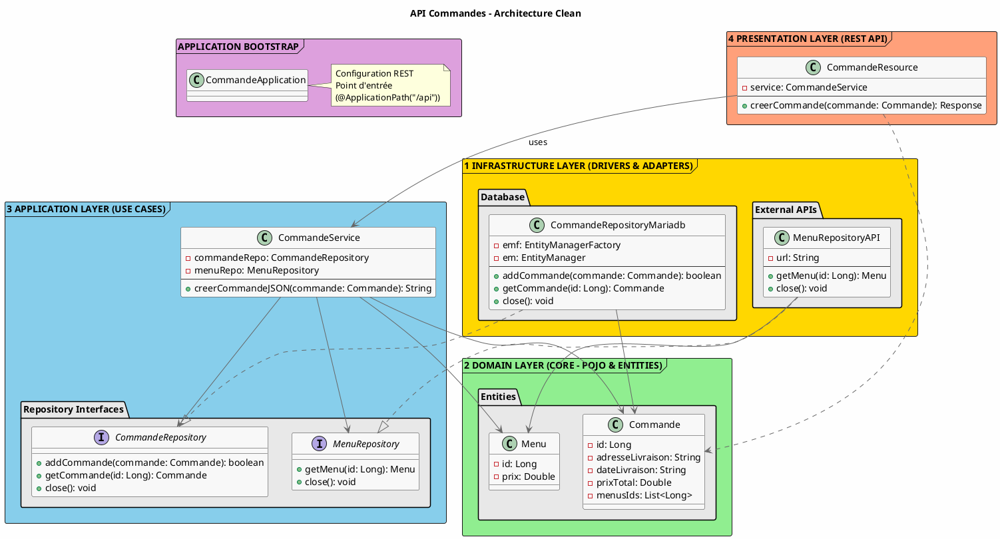
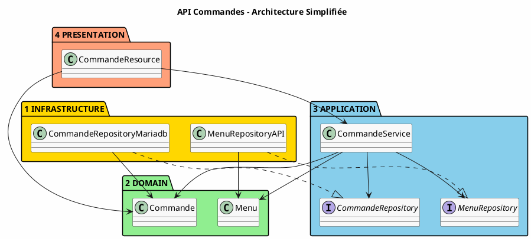

# Architecture du Projet Commandes - Pourquoi et Comment

## 🍽️ Contexte Métier

Ce projet gère les **commandes d'un restaurant**. Chaque commande :
- A une adresse de livraison
- A une date de livraison
- Regroupe l'identifiant d'un ou plusieurs menus (`menusIds`)
- A un prix total calculé à partir de la somme des prix des menus la composant

**Exemple concret** :
```
Commande "#12"
  ├─ Adresse : 10 avenue Victor Hugo, Aix-en-Provence
  ├─ Date livraison : 2026-04-10
  ├─ Menu ID #1 (Menu Provence - 22.50€)
  └─ Menu ID #2 (Menu Léger - 16.00€)
→ Prix total : 38.50€
```

Lors de la création d'une commande par un système tiers, l'API doit :
1. ✅ Parcourir les identifiants de menus transmis.
2. ✅ Interroger dynamiquement le service `Menus` (API externe) pour connaître le prix de chaque menu.
3. ✅ Calculer le prix total de la commande.
4. ✅ Sauvegarder la commande en base de données MariaDB.
5. ✅ Retourner la commande enregistrée au format JSON avec le prix calculé.

## 📐 Diagramme UML - Architecture en Couches



---

## 📐 Diagramme Simplifié (Vue Légère)



---

## 📁 Structure du Projet

```text
src/main/java/fr/univamu/iut/commandes/
│
├── web/                               ✅ PRESENTATION LAYER (REST)
│   ├── CommandeApplication.java      (Point d'entrée JAX-RS @ApplicationPath)
│   └── CommandeResource.java         (Endpoints @Path("/commandes"), @POST, etc.)
│
├── domain/                            ✅ DOMAIN LAYER (CORE - Entities & Interfaces)
│   ├── Commande.java                 (Entité JPA)
│   ├── Menu.java                     (POJO pour désérialisation du service Menu)
│   ├── CommandeRepository.java       (Contrat d'accès aux commandes)
│   └── MenuRepository.java           (Contrat d'accès aux menus)
│
├── application/                       🔄 APPLICATION LAYER (Business Logic)
│   └── CommandeService.java          (Règles métier : calcul de prix, orchestration)
│
└── infrastructure/                    🔌 INFRASTRUCTURE LAYER (Implementations)
    ├── persistence/
    │   └── CommandeRepositoryMariadb.java (Implémentation base de données JPA / MariaDB)
    └── external/
        └── MenuRepositoryAPI.java         (Implémentation de client HTTP REST externe)
```

## 🔄 Flux Réel d'une Requête POST /api/commandes

```text
1. Client HTTP (envoie JSON de la commande avec menusIds)
   ↓
2. CommandeResource.creerCommande(Commande)
   ├─ Instancie l'orchestrateur (CommandeService)
   ├─ Appelle CommandeService.creerCommandeJSON()
   │
3. CommandeService.creerCommandeJSON()
   ├─ Règle métier : calcul du prix !
   │  ├─ Boucle sur tous les identifiants de menus (getMenusIds)
   │  ├─ Pour chaque ID, appelle : menuRepo.getMenu(menuId)
   │  │  └─ MenuRepositoryAPI fait une requête HTTP GET vers l'API Menus
   │  │  └─ Reçoit le JSON "Menus" et lit le champ prixTotal (mappé sur Menu.prix)
   │  └─ Additionne les prix pour définir prixTotal de la Commande
   │
   ├─ Sauvegarde :
   │  └─ commandeRepo.addCommande(commande) → CommandeRepositoryMariadb → MariaDB (JPA)
   │
   └─ Sérialisation du résultat :
      └─ Transforme la Commande sauvegardée au format JSON (Jsonb)
   │
4. CommandeResource récupère le résultat
   ↓
5. Response 201 Created retransmise au Client HTTP
```

**Points clés** :
- `CommandeService` **ne sait pas** comment les commandes sont gérées côté base de données (seule l'interface `CommandeRepository` est utilisée).
- `CommandeService` **ne sait pas** comment le prix des menus est récupéré (que ça provienne d'une base locale ou d'une requête HTTP vers l'API Menus distante, cela ne regarde que l'implémentation masquée derrière l'interface `MenuRepository`).
- La logique métier (parcours des menus, calcul mathématique de la somme) est complètement isolée dans son propre domaine dans `CommandeService`.

## ✨ Pourquoi Cette Architecture Pour Ce Projet ?

### 1. **Robustesse et Indépendance (Microservices)** ✅
L'un des fondements du projet API Commandes consiste à récupérer les informations d'un autre service (`Menu`). 
En ayant isolé les accès HTTP dans la classe `MenuRepositoryAPI`, toute potentielle erreur provenant du Web externe peut y être bloquée.
**Par exemple** : si le service `Menus` se trouve hors ligne, le client HTTP peut isoler l'erreur dans la classe `MenuRepositoryAPI` en retournant un mock ou `null`, ce qui permet à `CommandeService` de réaliser son exécution coûte que coûte. 

### 2. **Remplacement des Implémentations** ✅
**Dans le passé / Testing** : Il était possible de travailler avec un fichier JSON pour la sauvegarde (ou `null`).
**Aujourd'hui** : on stocke les données dans MariaDB en passant par Jakarta Persistence API (JPA) à l'intérieur de `CommandeRepositoryMariadb`. S'il faut migrer sous PostgreSQL, rien de la couche Application ni Web ne sera touché : le changement n'impacte que la couche **Infrastructure**.

### 3. **Séparation des Responsabilités (SoD)** ✅
| Fichier / Dossier | Fait QUOI ? | Fait PAS QUOI ? |
|---------|-------------|------------------|
| `application/` (`CommandeService`) | Règles de calculs (les additions), orchestration. | Ne tape pas sur des bases de données ni des flux HTTP directement. |
| `web/` (`CommandeResource`) | Expose l'API REST, intercepte le corps de la requête. | Ne s'occupe pas de la persistance ou de la configuration. |
| `infrastructure/persistence` | Sauvegardes vers le SGBD avec `EntityManager` / JPA. | Pas de logique métier (calculs). |
| `infrastructure/external` | Établit les appels client JAX-RS / HTTP. | Ne fait pas de SQL. |

### 4. **Composabilité du Modèle `Menu`** ✅
Dans l'API Menus, un "Menu" contient beaucoup d'informations : listes de plats, dates, etc.
Le projet Commandes n'a absolument pas besoin de tout ça ! Le modèle DTO `Menu.java` dans le domaine Commandes est donc extrêmement léger (seulement `id` et `prix`). Il agit comme une projection uniquement construite pour traiter le nécessaire local, optimisant ainsi les temps de conversion et l'usage mémoire.

### 5. **Couplage faible de Commande** ✅
Pour référencer les Menus dans une Commande, il n'y a pas d'association relationnelle (`@OneToMany` physique vers la table Menus n'existe pas en DB pour Commandes). L'identifiant clé est simplement passé à l'aide d'une collection d'identifiants Java élémentaires (`menusIds`). C'est la base de tout modèle orienté **Microservices**, une base de données isolée n'a pas à référencer physiquement les clés étrangères d'une autre base.
