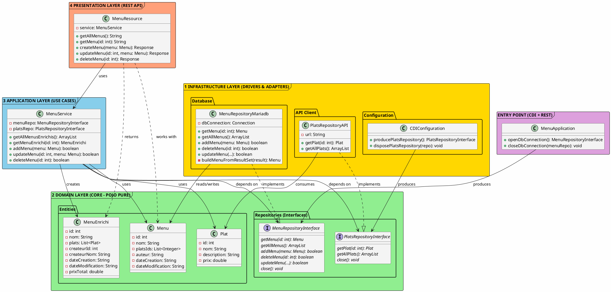

# Architecture Clean - Menus API

## Vue d'ensemble



## Structure du projet

```
source/java/menu/menus/
├── MenuApplication.java              (entry point, injection des repositories)
│
├── domain/
│   ├── entities/
│   │   ├── Menu.java                (simple POJO)
│   │   ├── Plat.java                (simple POJO)
│   │   └── MenuEnrichi.java         (simple POJO)
│   │
│   └── repositories/
│       ├── MenuRepositoryInterface.java
│       └── PlatsRepositoryInterface.java
│
├── application/services/
│   └── MenuService.java             (logique métier, les vrais use cases)
│
├── infrastructure/repositories/
│   ├── MenuRepositoryMariadb.java   (accès BD)
│   └── PlatsRepositoryAPI.java      (appelle l'API plats)
│
├── infrastructure/configuration/
│   └── CDIConfiguration.java        (production des PlatsRepository)
│
└── presentation/resources/
    └── MenuResource.java            (endpoints REST)
```


## Les dépendances

```
REST (MenuResource)
  ↓ uses
Service (MenuService)
  ↓ implements
Domain (interfaces)
  ↑ depends on
Infrastructure (MenuRepositoryMariadb, PlatsRepositoryAPI)
```

Les dépendances vont vers le Domain. C'est la clé.


## C'est clean architecture porque

- **Domain indépendant** - Menu.java/Plat.java sont juste des classes Java normales. Aucun framework dedans. Aucun import Jakarta, aucun import de BD.

- **Dépendances inversées** - MenuService dépend de MenuRepositoryInterface (abstraction), pas de MenuRepositoryMariadb (implémentation). Si on change de BD, on change juste l'implémentation.

- **Logique métier isolée** - MenuService ne connaît pas SQL, ne connaît pas HTTP, ne connaît pas JSON. Il connaît juste la logique des menus.

- **Facile à tester** - On peut tester MenuService avec des mocks. On peut tester le Domain en l'incluant dans n'importe quel projet Java.

- **Facile à changer** - Veux remplacer MariaDB par PostgreSQL? Change juste MenuRepositoryMariadb et crée PostgresRepositoryImplementation. Le reste ne change pas.


