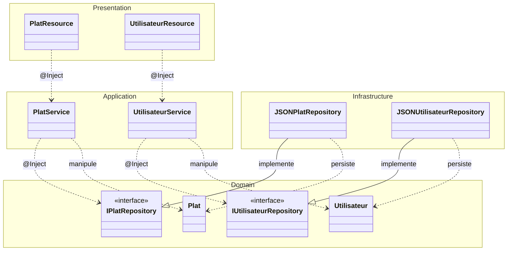

# Architecture du Projet Plats et Utilisateurs

Ce projet suit les principes de la **Clean Architecture** (ou Architecture en Couches) pour garantir une séparation stricte des responsabilités, faciliter la testabilité et assurer une maintenance aisée.

## 1. Structure du Projet

L'application est découpée en quatre couches principales, chacune ayant un rôle bien précis :

### 1.1. Domaine (`plats.domain`)
C'est le cœur de l'application. Elle contient la logique métier pure et les règles de gestion.
*   **Entities** (`plats.domain.entities`) : Contient les objets métier fondamentaux (`Plat`, `Utilisateur`). Ces objets sont des POJO (Plain Old Java Objects) sans dépendance technique.
*   **Repositories** (`plats.domain.repositories`) : Contient les interfaces définissant les contrats de stockage. Cette couche définit *ce qui* doit être fait sans savoir *comment* c'est fait techniquement.

### 1.2. Application (`plats.application`)
Cette couche orchestre la logique métier.
*   **Services** (`plats.application.services`) : Contient les classes de service (`PlatService`, `UtilisateurService`) qui manipulent les entités via les interfaces de repository. C'est ici que l'on applique le principe d'Inversion de Dépendance (DIP).

### 1.3. Infrastructure (`plats.infrastructure`)
C'est la couche technique qui implémente les détails de stockage.
*   **Repositories** (`plats.infrastructure.repositories`) : Contient les implémentations concrètes (`JSONPlatRepository`, `JSONUtilisateurRepository`) qui gèrent la persistance dans des fichiers JSON.

### 1.4. Présentation (`plats.presentation`)
Couche d'entrée de l'application.
*   **Resources** (`plats.presentation.resources`) : Expose les points d'entrée de l'API REST via Jersey. Elle transforme les requêtes réseau en appels aux services de la couche Application.

---

## 2. Diagramme de l'Architecture

Le diagramme suivant illustre le flux de dépendances. Notez que toutes les dépendances pointent vers le domaine (le centre).

---

## 3. Inversion de Dépendance et CDI

Le projet utilise **Jakarta CDI (Weld SE)** pour gérer l'injection de dépendances.
*   Les composants sont marqués avec `@ApplicationScoped`.
*   Les services reçoivent leurs repositories via `@Inject` sur l'interface (ex: `IPlatRepository`), permettant de changer d'implémentation (ex: passer de JSON à SQL) sans modifier le code métier.

---

## 4. Persistance des Données

Les données sont stockées de manière persistante dans deux fichiers à la racine du projet :
*   `plats.json` : Stocke la liste des plats.
*   `utilisateurs.json` : Stocke la liste des utilisateurs.

La sérialisation/désérialisation est gérée par **Jakarta JSON-B (Yasson)**. Les IDs sont générés automatiquement lors de la création d'une nouvelle entité.

---

## 5. Technologies Utilisées

*   **Jakarta EE 10** : Standard pour le développement Java Enterprise.
*   **Jersey** : Implémentation de JAX-RS pour les services REST.
*   **Grizzly** : Serveur HTTP léger utilisé pour le lancement en mode Standalone via une classe `Main`.
*   **Weld** : Implémentation de CDI pour le support de l'injection.
